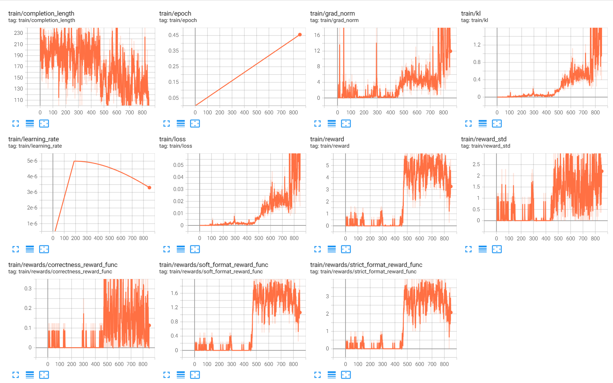

# qwen2.5-0.5b-grpo

GRPO Training based on Qwen2.5 0.5B 

# usage


```
conda create -n GRPO python=3.10
conda activate GRPO
pip install modelscope==1.9.5  # This will pull compatible datasets
pip install datasets==2.12.0   # Compatible with modelscope
pip install addict
pip install transformers==4.51.1  # Upgrade transformers to meet vllm's requirement
python3 -m pip install trl
python3 -m pip install tensorboard
pip install -U vllm
pip install typing_extensions
pip install fsspec==2023.9.2

# Uninstall incompatible datasets and fsspec if necessary
pip uninstall -y datasets fsspec

# Reinstall compatible versions
pip install datasets==2.12.0 fsspec==2023.9.2

# Install other dependencies
pip install -U -q trl==0.14.0
pip install -U -q peft==0.14.0
pip install -U -q accelerate==1.2.1
pip install -U -q math_verify==0.3.3
pip install sentence-transformers
pip install git+https://github.com/LLaVA-VL/LLaVA-NeXT.git
```


```
source activate base
pip install modelscope
pip install datasets
pip install addict
python3 -m pip install trl
python3 -m pip install tensorboard
pip install -U vllm
pip install typing_extensions
pip install modelscope==1.9.5
pip uninstall -y datasets fsspec
pip install datasets==2.12.0 fsspec==2023.9.2
pip install typing_extensions

pip install -U -q transformers==4.47.1
pip install -U -q trl==0.14.0
pip install -U -q datasets==3.2.0
pip install -U -q peft==0.14.0
pip install -U -q accelerate==1.2.1
pip install -U -q math_verify==0.3.3
pip install sentence-transformers
```

# run
```
torchrun --nproc_per_node 2 --num_processors 4  --master_port 1234 /home/aiscuser/qwen2.5-0.5b-rl/Untitled-2.py
```


## hardware

* NVIDIA A10 24GB x 1

## dataset

openai gsm8k

## time usage

45 minutes

## codes

* QwenGRPO.ipynb: training code
* QwenTest.ipynb: test code

## results



**"aha moment" occurred at step 500.**

---- 

query

```
树上7个鸟，又飞来1个鸟，一共几个鸟？
```

completion

```
<reasoning>
初始时，树上有 7 只鸟。后来又有 1 只鸟飞进来，所以总共的鸟的数量是 \(7 + 1 = 8\)。
</reasoning>
<answer>
8
</answer>
```

## ref

* [GRPO paper](refs/grpo/GRPO：Group%20Relative%20Policy%20Optimization.pdf)
* [Huggingface GRPOTrainer](https://huggingface.co/docs/trl/main/en/grpo_trainer)
* [Huggingface GRPOTrainer source code](https://github.com/huggingface/trl/blob/main/trl/trainer/grpo_trainer.py)
* [Unsloth R1](https://unsloth.ai/blog/r1-reasoning)
